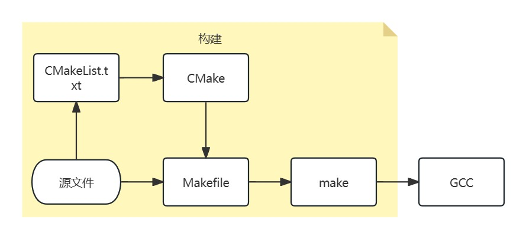

# CMake 1_CMake 基础概念

## 1. CMake 基本概念

**gcc（GNU Compiler Collection）**将源文件**编译（Compile）**成可执行文件或者库文件；

而当需要编译的东西很多时，需要说明先编译什么，后编译什么，这个过程称为**构建（Build）**。常用的工具是`make`，对应的定义构建过程的文件为`Makefile`；

而编写`Makefile`对于大型项目又比较复杂，通过`CMake`就可以使用更加简洁的语法定义构建的流程，`CMake`定义构建过程的文件为`CMakeLists.txt`。



## 2. CMake 一般使用流程

CMake提供`cmake`、`ctest`和`cpack`三个命令行工具分别负责构建、测试和打包。

> 使用CMake一般流程为：
>
> 1. 生成构建系统（buildsystem，比如`make`工具对应的`Makefile`）；
> 2. 执行构建（比如`make`），生成目标文件；
> 3. 执行测试、安装或打包。

###  生成构建系统

通过`cmake`命令生成构建系统。

通过`cmake --help`可以看到cmake命令支持的详细参数，常用的参数如下：

| 参数 | 含义                                                         |
| ---- | ------------------------------------------------------------ |
| `-S` | 指定源文件根目录(`src`)，必须包含一个`CMakeLists.txt`文件    |
| `-B` | 指定构建目录(`build`)，构建生成的中间文件和目标文件的生成路径 |
| `-D` | 指定变量，格式为`-D <var>=<value>`，`-D`后面的空格可以省略   |

###  执行构建

使用`cmake --build [<dir> | --preset <preset>]`执行构建。

这里要指定的目录就是生成构建系统时指定的构建目录。常用的参数如下：

| 参数                     | 含义                                         |
| ------------------------ | -------------------------------------------- |
| `--target`               | 指定构建目标代替默认的构建目标，可以指定多个 |
| `--parallel/-j [<jobs>]` | 指定构建目标时使用的进程数                   |

## 3. CMake 应用实例

```
1_CMake_Test
├── CMakeLists.txt
└── src
    └── main.c
```

- 编写`CMakeLists.txt`：

```cmake
cmake_minimum_required(VERSION 3.12)
project(1_CMake_Test VERSION 1.0.0 LANGUAGES C CXX)

add_executable(demo src/main.c)
```

- 生成构建系统

```shell
cmake -B build
```

执行完成后，在项目的根目录下会创建`build`目录，可以看到其中生成了`Makefile`文件。

> Windows 下默认为 `nmake` 构建，直接运行上述指令会报错：
>
> ```
> CMake Error at CMakeLists.txt:3 (project):
>   Running
> 
>    'nmake' '-?'
> 
>   failed with:
> 
>    no such file or directory
> 
> 
> CMake Error: CMAKE_C_COMPILER not set, after EnableLanguage
> CMake Error: CMAKE_CXX_COMPILER not set, after EnableLanguage
> -- Configuring incomplete, errors occurred!
> ```
>
> 需要指明`cmake`要生成`mingw make`使用的`Makefile`文件
>
> 生成构建系统时加入以下构建选项：
>
> ```shell
> cmake -G "MinGW Makefiles" -B build
> ```

- 执行构建

```shell
cmake --build build
```

也可以在`build`目录直接执行`make`命令。

执行完成后，可以在`build`目录下看到已经生成可执行文件`demo`。
