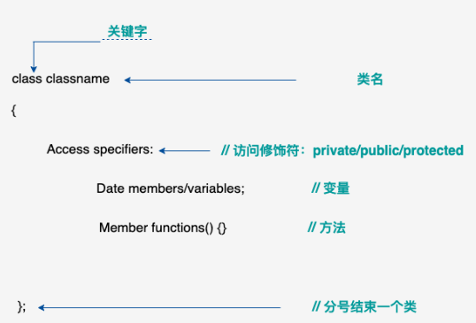
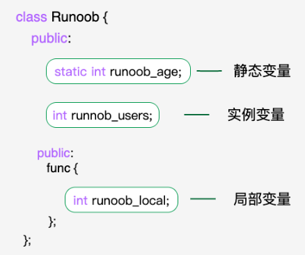
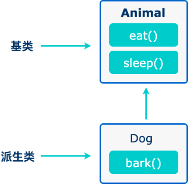

# C++ 3_面向对象

C++ 在 C 语言的基础上增加了面向对象编程，C++ 支持面向对象程序设计。类是 C++ 的核心特性，通常被称为用户定义的类型。

类用于指定对象的形式，是一种用户自定义的数据类型，它是一种封装了数据和函数的组合。

类中的数据称为成员变量，函数称为成员函数。

类可以被看作是一种模板，可以用来创建具有相同属性和行为的多个对象。

## 1. C++ 中的类和对象

- C++ 类的定义

    定义一个类需要使用关键字 `class`，然后指定类的名称，并类的主体是包含在一对花括号中，主体包含类的成员变量和成员函数。

    > 定义一个类，本质上是定义一个数据类型的蓝图，它定义了类的对象包括了什么，以及可以在这个对象上执行哪些操作。

    

    ```c++
    class Box
    {
       public:
          double length;   // 盒子的长度
          double breadth;  // 盒子的宽度
          double height;   // 盒子的高度
    };
    ```

- C++ 的对象

  类提供了对象的蓝图，所以基本上，对象是根据类来创建的。声明类的对象，就像声明基本类型的变量一样。
  
  ```c++
  Box Box1;          // 声明 Box1，类型为 Box
  Box Box2;          // 声明 Box2，类型为 Box
  ```
  
  > 对象 `Box1` 和 `Box2` 都有它们各自的数据成员。
  
  类的对象的**公共数据成员**可以使用直接成员访问运算符 `.` 来访问。

------

<font color=LightGreen>1. 类成员函数</font>

类的成员函数是指那些把定义和原型写在类定义内部的函数，就像类定义中的其他变量一样。

**类成员函数是类的一个成员，它可以操作类的任意对象，可以访问对象中的所有成员。**

成员函数可以定义在类定义内部，或者单独使用范围解析运算符 `::` 来定义。

- 在类定义中定义的成员函数把函数声明为内联的，即便没有使用 `inline` 标识符。

```c++
class Box
{
   public:
      double length;      // 长度
      double breadth;     // 宽度
      double height;      // 高度
   
      double getVolume(void)
      {
         return length * breadth * height;
      }
};
```

- 可以在类的外部使用范围解析运算符 `::` 定义成员函数。

```c++
double Box::getVolume(void)
{
    return length * breadth * height;
}
```

> 在 `::` 运算符之前必须使用类名。调用成员函数是在对象上使用点运算符 `.`，这样它就能操作与该对象相关的数据。

<font color=LightGreen>2. 类访问修饰符</font>

数据封装是面向对象编程的一个重要特点，它防止函数直接访问类类型的内部成员。

类成员的访问限制是通过在类主体内部对各个区域标记 `public`、`private`、`protected` 来指定的。关键字 `public`、`private`、`protected` 称为访问修饰符。

一个类可以有多个 `public`、`protected` 或 `private` 标记区域。每个标记区域在下一个标记区域开始之前或者在遇到类主体结束右括号之前都是有效的。成员和类的默认访问修饰符是 `private`。

```c++
class Base {
   public:// 公有成员
 
   protected:// 受保护成员
 
   private:// 私有成员
};
```

- **公有成员在程序中类的外部是可访问的**。可以不使用任何成员函数来设置和获取公有变量的值。

- **私有成员变量或函数在类的外部是不可访问的，甚至是不可查看的**。只有类和友元函数可以访问私有成员。默认情况下，类的所有成员都是私有的。

  > 一般会在私有区域定义数据，在公有区域定义相关的函数，以便在类的外部也可以调用这些函数。

  ```c++
  #include <iostream>
   
  using namespace std;
   
  class Box
  {
     public:
        double length;
        void setWidth( double wid );
        double getWidth( void );
   
     private:
        double width;
  };
   
  // 成员函数定义
  double Box::getWidth(void)
  {
      return width ;
  }
   
  void Box::setWidth( double wid )
  {
      width = wid;
  }
   
  // 程序的主函数
  int main( )
  {
     Box box;
   
     // 不使用成员函数设置长度
     box.length = 10.0; // OK: 因为 length 是公有的
     cout << "Length of box : " << box.length <<endl;
   
     // 不使用成员函数设置宽度
     // box.width = 10.0; // Error: 因为 width 是私有的
     box.setWidth(10.0);  // 使用成员函数设置宽度
     cout << "Width of box : " << box.getWidth() <<endl;
   
     return 0;
  }
  ```

- 受保护成员变量或函数与私有成员十分相似，但有一点不同，**受保护成员在派生类（即子类）中是可访问的。**

<font color=LightGreen>3. 构造函数和析构函数</font>

- 构造函数

    类的构造函数是类的一种特殊的成员函数，它会在每次创建类的新对象时执行。

    构造函数的名称与类的名称是完全相同的，并且不会返回任何类型，也不会返回 `void`。

    构造函数可用于为某些成员变量设置初始值。

    ```c++
    class Line
    {
       public:
          void setLength( double len );
          double getLength( void );
          Line();  // 这是构造函数
    
       private:
          double length;
    };
    
    // 成员函数定义，包括构造函数
    Line::Line(void)
    {
        cout << "Object is being created" << endl;
    }
    ```

    > 默认的构造函数没有任何参数，但如果需要，构造函数也可以带有参数。这样在创建对象时就会给对象赋初始值。
    >
    > ```c++
    > class Line
    > {
    >    public:
    >       void setLength(double len);
    >       double getLength(void);
    >       Line(double len);  // 这是构造函数
    >  
    >    private:
    >       double length;
    > };
    >  
    > // 成员函数定义，包括构造函数
    > Line::Line(double len)
    > {
    >     cout << "Object is being created, length = " << len << endl;
    >     length = len;
    > }
    > ```

- 析构函数

    类的析构函数是类的一种特殊的成员函数，它会在每次删除所创建的对象时执行。

    析构函数的名称与类的名称是完全相同的，只是在前面加了个波浪号`~`作为前缀，它不会返回任何值，也不能带有任何参数。

    析构函数有助于在跳出程序（比如关闭文件、释放内存等）前释放资源。

    ```c++
    class Line
    {
       public:
          void setLength(double len);
          double getLength(void);
          Line();   // 这是构造函数声明
          ~Line();  // 这是析构函数声明
    
       private:
          double length;
    };
    
    // 成员函数定义，包括构造函数
    Line::Line(void)
    {
        cout << "Object is being created" << endl;
    }
    
    Line::~Line(void)
    {
        cout << "Object is being deleted" << endl;
    }
    ```

<font color=LightGreen>4. 友元</font>

类的友元函数是定义在类外部，但**有权访问类的所有私有员和保护成员**。

尽管友元函数的原型有在类的定义中出现过，但是**友元函数并不是成员函数**。

友元可以是一个函数，该函数被称为友元函数；友元也可以是一个类，该类被称为友元类，在这种情况下，整个类及其所有成员都是友元。

- 如果要声明函数为一个类的友元，需要在类定义中该函数原型前使用关键字 `friend`。

  ```c++
  class Box
  {
     double width;
  public:
     double length;
     friend void printWidth( Box box );
     void setWidth( double wid );
  };
  ```

- 声明类 `ClassTwo` 的所有成员函数作为类 `ClassOne` 的友元，需要在类 `ClassOne` 的定义中放置如下声明：

  ```c++
  friend class ClassTwo;
  ```

<font color=LightGreen>5. `this`指针</font>

在 C++ 中，this 指针是一个特殊的指针，它指向当前对象的实例。

在 C++ 中，每一个对象都能通过 `this` 指针来访问自己的地址。

`this`是一个隐藏的指针，可以在类的成员函数中使用，它可以用来指向调用对象。当一个对象的成员函数被调用时，编译器会隐式地传递该对象的地址作为 `this` 指针。

> 友元函数没有 `this` 指针，因为友元不是类的成员，只有成员函数才有 `this` 指针。

```c++
#include <iostream>
 
using namespace std;
 
class Box
{
   public:
      // 构造函数定义
      Box(double l=2.0, double b=2.0, double h=2.0)
      {
         cout <<"调用构造函数。" << endl;
         length = l;
         breadth = b;
         height = h;
      }
      double Volume()
      {
         return length * breadth * height;
      }
      int compare(Box box)
      {
         return this->Volume() > box.Volume();
      }
   private:
      double length;     // 宽度
      double breadth;    // 长度
      double height;     // 高度
};
 
int main(void)
{
   Box Box1(3.3, 1.2, 1.5);    // 声明 box1
   Box Box2(8.5, 6.0, 2.0);    // 声明 box2
 
   if(Box1.compare(Box2))
   {
      cout << "Box2 的体积比 Box1 小" <<endl;
   }
   else
   {
      cout << "Box2 的体积大于或等于 Box1" <<endl;
   }
   return 0;
}
```

<font color=LightGreen>6. 指向类的指针</font>

一个指向 C++ 类的指针与指向结构的指针类似，访问指向类的指针的成员，需要使用成员访问运算符 `->`，就像访问指向结构的指针一样。与所有的指针一样，必须在使用指针之前，对指针进行初始化。

在 C++ 中，指向类的指针指向一个类的对象，与普通的指针相似，指向类的指针可以用于访问对象的成员变量和成员函数。

<font color=LightGreen>7. 静态成员</font>

- 静态成员变量

    可以使用 `static` 关键字来把类成员定义为静态的。当声明类的成员为静态时，这意味着无论创建多少个类的对象，静态成员都只有一个副本。

    

    **静态成员在类的所有对象中是共享的**。如果不存在其他的初始化语句，在创建第一个对象时，所有的静态数据都会被初始化为零。

    **不能把静态成员的初始化放置在类的定义中**，但是可以在类的外部通过使用范围解析运算符 `::` 来重新声明静态变量从而对它进行初始化。
    
- 静态成员函数

    如果把函数成员声明为静态的，就可以把函数与类的任何特定对象独立开来。

    静态成员函数即使在类对象不存在的情况下也能被调用，静态函数只要使用类名加范围解析运算符 `::` 就可以访问。

    **静态成员函数只能访问静态成员数据、其他静态成员函数和类外部的其他函数。**

    静态成员函数有一个类范围，他们不能访问类的 this 指针。

## 2. C++ 继承

继承允许依据另一个类来定义一个类，这使得创建和维护一个应用程序变得更容易。这样做，也达到了重用代码功能和提高执行效率的效果。

当创建一个类时，不需要重新编写新的数据成员和成员函数，只需指定新建的类继承了一个已有的类的成员即可。这个已有的类称为基类，新建的类称为派生类。



```c++
// 基类
class Animal {
    // eat() 函数
    // sleep() 函数
};


//派生类
class Dog : public Animal {
    // bark() 函数
};
```

> 一个类可以派生自多个类，这意味着，它可以从多个基类继承数据和函数。定义一个派生类，我们使用一个类派生列表来指定基类。类派生列表以一个或多个基类命名。
>
> ```c++
> class derived-class: access-specifier base-class
> ```
>
> 访问修饰符 `access-specifier` 是 `public`、`protected` 或 `private` 其中的一个，`base-class` 是之前定义过的某个类的名称。如果未使用访问修饰符` access-specifier`，则默认为` private`。

- **派生类可以访问基类中所有的非私有成员**。因此基类成员如果不想被派生类的成员函数访问，则应在基类中声明为 `private`。

    | 访问     | `public` | `protected` | `private` |
    | :------- | :------- | :---------- | :-------- |
    | 同一个类 | yes      | yes         | yes       |
    | 派生类   | yes      | yes         | no        |
    | 外部的类 | yes      | no          | no        |

    > 一个派生类继承了所有的基类方法，但下列情况除外：
    >
    > - 基类的构造函数、析构函数和拷贝构造函数。
    > - 基类的重载运算符。
    > - 基类的友元函数。

- 当一个类派生自基类，该基类可以被继承为 `public`、`protected` 或 `private` 几种类型。继承类型是通过访问修饰符 `access-specifier` 来指定的。

    几乎不使用 protected 或 private 继承，通常使用 public 继承。当使用不同类型的继承时，遵循以下几个规则：

    1. 公有继承（public）：当一个类派生自公有基类时，基类的公有成员也是派生类的公有成员，基类的保护成员也是派生类的保护成员，基类的私有成员不能直接被派生类访问，但是可以通过调用基类的公有和保护成员来访问。
    2. 保护继承（protected）： 当一个类派生自保护基类时，基类的公有和保护成员将成为派生类的保护成员。
    3. 私有继承（private）：当一个类派生自私有基类时，基类的公有和保护成员将成为派生类的私有成员。

- 多继承

  ```c++
  class <派生类名>:<继承方式1><基类名1>,<继承方式2><基类名2>,…
  {
  <派生类类体>
  };
  ```

## 3. C++ 多态

多态按字面的意思就是多种形态。当类之间存在层次结构，并且类之间是通过继承关联时，就会用到多态。

C++ 多态意味着**调用成员函数时，会根据调用函数的对象的类型来执行不同的函数。**

```c++
#include <iostream> 
using namespace std;
 
class Shape {
   protected:
      int width, height;
   public:
      Shape( int a=0, int b=0)
      {
         width = a;
         height = b;
      }
      int area()
      {
         cout << "Parent class area :" <<endl;
         return 0;
      }
};
class Rectangle: public Shape{
   public:
      Rectangle( int a=0, int b=0):Shape(a, b) { }
      int area ()
      { 
         cout << "Rectangle class area :" <<endl;
         return (width * height); 
      }
};
class Triangle: public Shape{
   public:
      Triangle( int a=0, int b=0):Shape(a, b) { }
      int area ()
      { 
         cout << "Triangle class area :" <<endl;
         return (width * height / 2); 
      }
};
// 程序的主函数
int main( )
{
   Shape *shape;
   Rectangle rec(10,7);
   Triangle  tri(10,5);
 
   // 存储矩形的地址
   shape = &rec;
   // 调用矩形的求面积函数 area
   shape->area();
 
   // 存储三角形的地址
   shape = &tri;
   // 调用三角形的求面积函数 area
   shape->area();
   
   return 0;
}
```

> 导致错误输出的原因是，调用函数 `area()` 被编译器设置为基类中的版本，这就是所谓的静态多态，或静态链接 - 函数调用在程序执行前就准备好了。有时候这也被称为早绑定，因为 `area()` 函数在程序编译期间就已经设置好了。

**每个子类都有同一种函数的独立实现**。这就是多态的一般使用方式。

有了多态，可以有多个不同的类，都带有同一个名称但具有不同实现的函数，函数的参数甚至可以是相同的。

虚函数是在基类中使用关键字 `virtual` 声明的函数。在派生类中重新定义基类中定义的虚函数时，会告诉编译器不要静态链接到该函数。

想要的是在程序中任意点可以根据所调用的对象类型来选择调用的函数，这种操作被称为动态链接，或后期绑定。

> 可能想要在基类中定义虚函数，以便在派生类中重新定义该函数更好地适用于对象，但是您在基类中又不能对虚函数给出有意义的实现，这个时候就会用到纯虚函数。
>
> ```c++
> // = 0 告诉编译器，函数没有主体
> virtual int area() = 0;
> ```

- > **定义一个函数为虚函数，不代表函数为不被实现的函数。定义为虚函数是为了允许用基类的指针来调用子类的这个函数。**
  >
  > **定义一个函数为纯虚函数，才代表函数没有被实现。定义纯虚函数是为了实现一个接口，起到一个规范的作用，规范继承这个类的程序员必须实现这个函数。**
