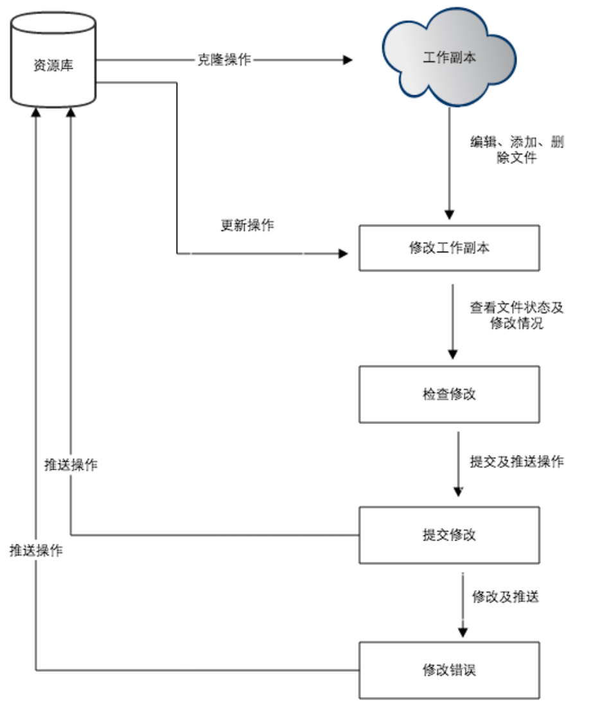
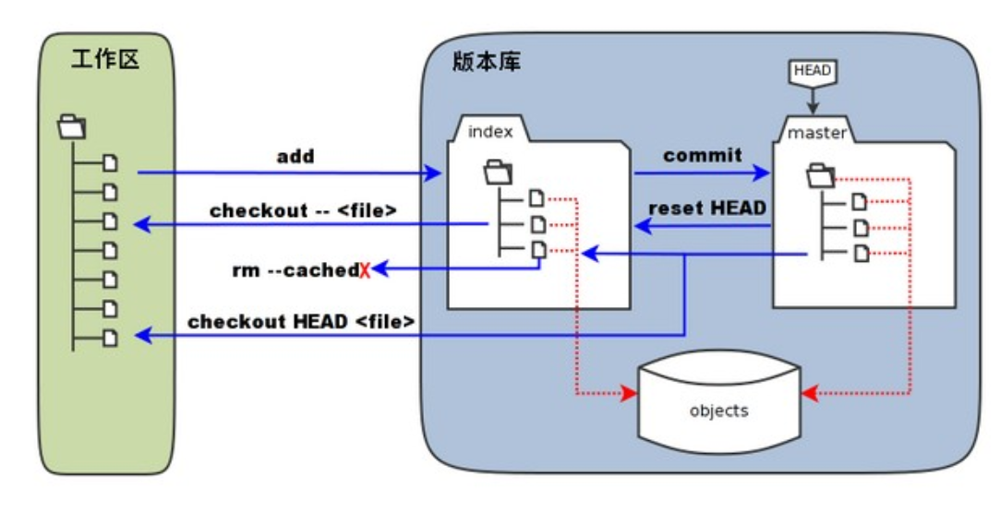
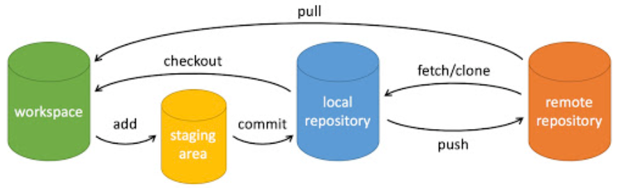

# Git 2_Git的工作流程

Git 的一般工作流程如下：

> - 克隆 Git 资源作为工作目录。
> - 在克隆的资源上添加或修改文件。
> - 如果其他人修改了，你可以更新资源。
> - 在提交前查看修改。
> - 提交修改。
> - 在修改完成后，如果发现错误，可以撤回提交并再次修改并提交。



## 1. 工作区，暂存区和版本库

- **工作区：**就是你在电脑里能看到的目录。
- **暂存区：**英文叫 stage 或 index。一般存放在 `.git` 目录下的 index 文件（`.git/index`）中，所以我们把暂存区有时也叫作索引（index）。
- **版本库：**工作区有一个隐藏目录 `.git`，这个不算工作区，而是 Git 的版本库。



> - 图中左侧为工作区，右侧为版本库。在版本库中标记为 "index" 的区域是暂存区（stage/index），标记为 "master" 的是 master 分支所代表的目录树。
> - 图中我们可以看出此时 "HEAD" 实际是指向 master 分支的一个"游标"。所以图示的命令中出现 HEAD 的地方可以用 master 来替换。
> - 图中的 objects 标识的区域为 Git 的对象库，实际位于 ".git/objects" 目录下，里面包含了创建的各种对象及内容。
> - 当对工作区修改（或新增）的文件执行 `git add` 命令时，暂存区的目录树被更新，同时工作区修改（或新增）的文件内容被写入到对象库中的一个新的对象中，而该对象的ID被记录在暂存区的文件索引中。
> - 当执行提交操作（`git commit`）时，暂存区的目录树写到版本库（对象库）中，master 分支会做相应的更新。即 master 指向的目录树就是提交时暂存区的目录树。
> - 当执行 `git reset HEAD` 命令时，暂存区的目录树会被重写，被 master 分支指向的目录树所替换，但是工作区不受影响。
> - 当执行 `git rm --cached <file>` 命令时，会直接从暂存区删除文件，工作区则不做出改变。
> - 当执行 `git checkout .` 或者 `git checkout -- <file>` 命令时，会用暂存区全部或指定的文件替换工作区的文件。这个操作很危险，会清除工作区中未添加到暂存区中的改动。
> - 当执行 `git checkout HEAD .` 或者 `git checkout HEAD <file>` 命令时，会用 HEAD 指向的 master 分支中的全部或者部分文件替换暂存区和以及工作区中的文件。这个命令也是极具危险性的，因为不但会清除工作区中未提交的改动，也会清除暂存区中未提交的改动。

## 2. Git 仓库创建

### `git init`

使用此命令将当前目录作为 Git 工作区。该命令执行完后会在当前目录生成一个 .git 目录。

可以使用以下命令指定 Git 仓库位置。

```shell
$ git init newrepo
```

如果当前目录下有几个文件想要纳入版本控制，需要先用 `git add` 命令告诉 Git 开始对这些文件进行跟踪，然后提交：

```shell
$ git add *.c
$ git add README
$ git commit -m '初始化项目版本'
```

> 以上命令将目录下以 `.c` 结尾及 `README` 文件提交到仓库中。

> 在 Linux 系统中，commit 信息使用单引号 `'`，Windows 系统，commit 信息使用双引号 `"`。所以在 `git bash` 中 `git commit -m '提交说明'` 这样是可以的，在 Windows 命令行中就要使用双引号 `git commit -m "提交说明"`。

### `git clone`

使用此命令从现有 Git 仓库中拷贝项目。

```shell
$ git clone <repo>
```

若需要克隆到指定的目录，可以使用以下命令格式：

```shell
$ git clone <repo> <directory>

# repo:		Git 仓库。
# directory:本地目录。
```

### `git config`

编辑配置文件：

```shell
$ git config -e    # 针对当前仓库 
$ git config -e --global   # 针对系统上所有仓库
```

## 3. Git 基本操作



### 提交和修改

Git 的工作就是创建和保存项目的快照及与之后的快照进行对比。

#### `git add`

`git add` 命令可将该文件的修改添加到暂存区。通过运行 `git add` 命令，可以告诉 Git 哪些文件的修改应该包含在下一次提交（commit）中。

```shell
$ git add [file1] [file2] ...	 # 添加一个或多个文件到暂存区
$ git add [dir]			   		# 添加指定目录到暂存区，包括子目录
$ git add .				   		# 添加当前目录下的所有文件到暂存区
```

#### `git status`

`git status` 命令可以查看在你上次提交之后是否有对文件进行再次修改。

```shell
$ git status
On branch master

Initial commit

Changes to be committed:
  (use "git rm --cached <file>..." to unstage)

    new file:   README
    new file:   hello.php
```

> `git status` 命令会显示以下信息：
>
> - 当前分支的名称。
> - 当前分支与远程分支的关系（例如，是否是最新的）。
> - 未暂存的修改：显示已修改但尚未使用 `git add` 添加到暂存区的文件列表。
> - 未跟踪的文件：显示尚未纳入版本控制的新文件列表。

通常使用 `-s` 参数来获得简短的输出结果。

#### `git diff`

`git diff` 命令显示已写入暂存区和已经被修改但尚未写入暂存区文件的区别。

```shell
$ git diff [file]							# 显示暂存区和工作区的差异
$ git diff --cached [file]	 				 # 显示暂存区和上一次提交(commit)的差异
$ git diff [first-branch]...[second-branch]	  # 显示两次提交的差异
```

#### `git commit`

`git commit` 命令将暂存区内容添加到本地仓库中。

```shell
$ git commit -m [message]						# 提交暂存区到本地仓库中,[message] 可以是一些备注信息
$ git commit [file1] [file2] ... -m [message]	  # 提交暂存区的指定文件到仓库区
```

`-a` 参数设置修改文件后不需要执行 `git add` 命令，直接来提交。

```shell
$ git commit -a
```

