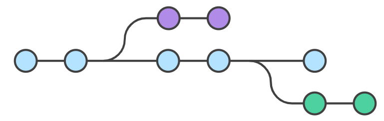

# Git 2_Git的工作流程

Git 的一般工作流程如下：

> - 克隆 Git 资源作为工作目录。
> - 在克隆的资源上添加或修改文件。
> - 如果其他人修改了，你可以更新资源。
> - 在提交前查看修改。
> - 提交修改。
> - 在修改完成后，如果发现错误，可以撤回提交并再次修改并提交。


## 1. 工作区，暂存区和版本库

- **工作区：**就是你在电脑里能看到的目录。
- **暂存区：**英文叫 stage 或 index。一般存放在 `.git` 目录下的 index 文件（`.git/index`）中，所以我们把暂存区有时也叫作索引（index）。
- **版本库：**工作区有一个隐藏目录 `.git`，这个不算工作区，而是 Git 的版本库。


> - 图中左侧为工作区，右侧为版本库。在版本库中标记为 "index" 的区域是暂存区（stage/index），标记为 "master" 的是 master 分支所代表的目录树。
> - 图中我们可以看出此时 "HEAD" 实际是指向 master 分支的一个"游标"。所以图示的命令中出现 HEAD 的地方可以用 master 来替换。
> - 图中的 objects 标识的区域为 Git 的对象库，实际位于 ".git/objects" 目录下，里面包含了创建的各种对象及内容。
> - 当对工作区修改（或新增）的文件执行 `git add` 命令时，暂存区的目录树被更新，同时工作区修改（或新增）的文件内容被写入到对象库中的一个新的对象中，而该对象的ID被记录在暂存区的文件索引中。
> - 当执行提交操作（`git commit`）时，暂存区的目录树写到版本库（对象库）中，master 分支会做相应的更新。即 master 指向的目录树就是提交时暂存区的目录树。
> - 当执行 `git reset HEAD` 命令时，暂存区的目录树会被重写，被 master 分支指向的目录树所替换，但是工作区不受影响。
> - 当执行 `git rm --cached <file>` 命令时，会直接从暂存区删除文件，工作区则不做出改变。
> - 当执行 `git checkout .` 或者 `git checkout -- <file>` 命令时，会用暂存区全部或指定的文件替换工作区的文件。这个操作很危险，会清除工作区中未添加到暂存区中的改动。
> - 当执行 `git checkout HEAD .` 或者 `git checkout HEAD <file>` 命令时，会用 HEAD 指向的 master 分支中的全部或者部分文件替换暂存区和以及工作区中的文件。这个命令也是极具危险性的，因为不但会清除工作区中未提交的改动，也会清除暂存区中未提交的改动。

## 2. Git 仓库创建

### `git init`

使用此命令将当前目录作为 Git 工作区。该命令执行完后会在当前目录生成一个 .git 目录。

可以使用以下命令指定 Git 仓库位置。

```shell
$ git init newrepo
```

如果当前目录下有几个文件想要纳入版本控制，需要先用 `git add` 命令告诉 Git 开始对这些文件进行跟踪，然后提交：

```shell
$ git add *.c
$ git add README
$ git commit -m '初始化项目版本'
```

> 以上命令将目录下以 `.c` 结尾及 `README` 文件提交到仓库中。

> 在 Linux 系统中，commit 信息使用单引号 `'`，Windows 系统，commit 信息使用双引号 `"`。所以在 `git bash` 中 `git commit -m '提交说明'` 这样是可以的，在 Windows 命令行中就要使用双引号 `git commit -m "提交说明"`。

### `git clone`

使用此命令从现有 Git 仓库中拷贝项目。

```shell
$ git clone <repo>
```

若需要克隆到指定的目录，可以使用以下命令格式：

```shell
$ git clone <repo> <directory>

# repo:		Git 仓库。
# directory:本地目录。
```

### `git config`

编辑配置文件：

```shell
$ git config -e    # 针对当前仓库 
$ git config -e --global   # 针对系统上所有仓库
```

## 3. Git 基本操作


### 提交和修改

Git 的工作就是创建和保存项目的快照及与之后的快照进行对比。

#### `git add`

`git add` 命令可将该文件的修改添加到暂存区。通过运行 `git add` 命令，可以告诉 Git 哪些文件的修改应该包含在下一次提交（commit）中。

```shell
$ git add [file1] [file2] ...	 # 添加一个或多个文件到暂存区
$ git add [dir]			   		# 添加指定目录到暂存区，包括子目录
$ git add .				   		# 添加当前目录下的所有文件到暂存区
```

#### `git status`

`git status` 命令可以查看在你上次提交之后是否有对文件进行再次修改。

```shell
$ git status
On branch master

Initial commit

Changes to be committed:
  (use "git rm --cached <file>..." to unstage)

    new file:   README
    new file:   hello.php
```

> `git status` 命令会显示以下信息：
>
> - 当前分支的名称。
> - 当前分支与远程分支的关系（例如，是否是最新的）。
> - 未暂存的修改：显示已修改但尚未使用 `git add` 添加到暂存区的文件列表。
> - 未跟踪的文件：显示尚未纳入版本控制的新文件列表。

通常使用 `-s` 参数来获得简短的输出结果。

#### `git diff`

`git diff` 命令显示已写入暂存区和已经被修改但尚未写入暂存区文件的区别。

```shell
$ git diff [file]							# 显示暂存区和工作区的差异
$ git diff --cached [file]	 				 # 显示暂存区和上一次提交(commit)的差异
$ git diff [first-branch]...[second-branch]	  # 显示两次提交的差异
```

#### `git commit`

`git commit` 命令将暂存区内容添加到本地仓库中。

```shell
$ git commit -m [message]						# 提交暂存区到本地仓库中,[message] 可以是一些备注信息
$ git commit [file1] [file2] ... -m [message]	  # 提交暂存区的指定文件到仓库区
```

`-a` 参数设置修改文件后不需要执行 `git add` 命令，直接来提交。

```shell
$ git commit -a
```

#### `git reset`

`git reset` 命令用于回退版本，可以指定退回某一次提交的版本。

```shell
$ git reset [--soft | --mixed | --hard] [HEAD]
```

`--mixed` 为默认，可以不用带该参数，用于重置暂存区的文件与上一次的提交(commit)保持一致，工作区文件内容保持不变。

```shell
$ git reset HEAD^            # 回退所有内容到上一个版本  
$ git reset HEAD^ hello.php  # 回退 hello.php 文件的版本到上一个版本  
$ git reset 052e             # 回退到指定版本
```

` --soft` 参数用于回退到某个版本。

```shell
$ git reset --soft HEAD~3   # 回退上上上一个版本 
```

`--hard` 参数撤销工作区中所有未提交的修改内容，将暂存区与工作区都回到上一次版本，并删除之前的所有信息提交。

```shell
$ git reset --hard HEAD~3  			# 回退上上上一个版本  
$ git reset --hard bae128  			# 回退到某个版本回退点之前的所有信息。 
$ git reset --hard origin/master     # 将本地的状态回退到和远程的一样 
```

> **HEAD 说明：**
>
> - `HEAD` 表示当前版本
> - `HEAD^` 上一个版本
> - `HEAD^^` 上上一个版本
> - `HEAD^^^` 上上上一个版本
>
> 可以使用 ～数字表示：
>
> - `HEAD~0` 表示当前版本
> - `HEAD~1` 上一个版本
> - `HEAD^2` 上上一个版本
> - `HEAD^3` 上上上一个版本

#### `git rm`

`git rm` 命令用于删除文件。

如果只是简单地从工作目录中手工删除文件，运行 `git status` 时就会出现 `Changes not staged for commit` 的提示。

```shell
$ git rm <file>	# 将文件从暂存区和工作区中删除
```

如果删除之前修改过并且已经放到暂存区域的话，则必须要用强制删除选项 `-f`。

如果想把文件从暂存区域移除，但仍然希望保留在当前工作目录中，换句话说，仅是从跟踪清单中删除，使用 `--cached` 选项即可。

#### `git mv`

`git mv` 命令用于移动或重命名一个文件、目录或软连接。

```shell
$ git mv [file] [newfile]
```

如果新文件名已经存在，但还是要重命名它，可以使用 `-f` 参数

#### `git checkout`

`git checkout` 命令用于在不同的分支之间切换、恢复文件、创建新分支等操作。

```shell
$ git checkout <branch-name>		# 从当前分支切换到指定的分支 <branch-name>
$ git checkout -b <new-branch-name>  # 创建一个新分支 <new-branch-name> 并立即切换到新创建的分支
$ git checkout -				    # 切换回前一个分支
$ git checkout -- <file>			# 将指定文件 <file> 恢复到最新的提交状态，丢弃所有未提交的更改
```

### 远程操作

#### `git remote`

`git remote` 命令用于用于管理 Git 仓库中的远程仓库。

`git remote` 命令提供了一些用于查看、添加、重命名和删除远程仓库的功能。

> - `git remote`：列出当前仓库中已配置的远程仓库。
> - `git remote -v`：列出当前仓库中已配置的远程仓库，并显示它们的 URL。
> - `git remote add <remote_name> <remote_url>`：添加一个新的远程仓库。指定一个远程仓库的名称和 URL，将其添加到当前仓库中。
> - `git remote rename <old_name> <new_name>`：将已配置的远程仓库重命名。
> - `git remote remove <remote_name>`：从当前仓库中删除指定的远程仓库。
> - `git remote set-url <remote_name> <new_url>`：修改指定远程仓库的 URL。
> - `git remote show <remote_name>`：显示指定远程仓库的详细信息，包括 URL 和跟踪分支。

#### `git fetch`

`git fetch` 命令用于从远程获取代码库。

```shell
$ git merge	# 从远端仓库提取数据并尝试合并到当前分支
```

该命令就是在执行 `git fetch` 之后紧接着执行 `git merge` 远程分支到你所在的任意分支。

```shell
$ git fetch [alias]				# 去获取更新的数据
$ git merge [alias]/[branch]	 # 将服务器上的任何更新合并到当前分支
```

#### `git pull`

`git pull` 命令用于从远程获取代码并合并本地的版本。

`git pull` 其实就是 `git fetch` 和 `git merge FETCH_HEAD` 的简写。

```shell
$ git pull <远程主机名> <远程分支名>:<本地分支名>
```

#### `git push`

`git push` 命令用于从将本地的分支版本上传到远程并合并。

```shell
$ git push <远程主机名> <本地分支名>:<远程分支名>
```

如果本地版本与远程版本有差异，但又要强制推送可以使用 `--force` 参数。

删除主机的分支可以使用 `--delete` 参数。

## 4. Git 分支管理

每一种版本控制系统都以某种形式支持分支，一个分支代表一条独立的开发线。使用分支意味着你可以从开发主线上分离开来，然后在不影响主线的同时继续工作。



```shell
$ git branch {branchname}		# 创建分支
$ git checkout {branchname} 	# 切换到某个分支
```

当切换分支的时候，Git 会用该分支的最后提交的快照替换你的工作目录的内容， 所以多个分支不需要多个目录。

### `git branch`

没有参数时，`git branch` 会列出你在本地的分支。执行 `git init` 的时候，默认情况下 Git 就会为你创建 `master` 分支。

如果要手动创建一个分支，执行 `git branch (branchname)` 即可。

删除分支使用以下命令：

```shell
$ git branch -d (branchname)
```

### `git merge`

一旦某分支有了独立内容，可以使用以下命令将任何分支合并到当前分支中去。

```shell
$ git merge
```

合并完后就可以删除分支。

> 合并并不仅仅是简单的文件添加、移除的操作，Git 也会合并修改。对于两个分支内的同一文件，如果有不同内容，会产生合并冲突，此时需要手动解决冲突。

## 5. 查看提交历史

Git 提交历史一般常用两个命令：

- `git log` - 查看历史提交记录。
- `git blame <file>` - 以列表形式查看指定文件的历史修改记录。

### `git log`

在使用 Git 提交了若干更新之后，又或者克隆了某个项目，想回顾下提交历史，可以使用 `git log` 命令查看。`git log` 命令用于查看 Git 仓库中提交历史记录。`git log` 显示了从最新提交到最早提交的所有提交信息，包括提交的哈希值、作者、提交日期和提交消息等。

```shell
$ git log [选项] [分支名/提交哈希]
```

> - `-p`：显示提交的补丁（具体更改内容）。
> - `--oneline`：以简洁的一行格式显示提交信息。
> - `--graph`：以图形化方式显示分支和合并历史。
> - `--decorate`：显示分支和标签指向的提交。
> - `--author=<作者>`：只显示特定作者的提交。
> - `--since=<时间>`：只显示指定时间之后的提交。
> - `--until=<时间>`：只显示指定时间之前的提交。
> - `--grep=<模式>`：只显示包含指定模式的提交消息。
> - `--no-merges`：不显示合并提交。
> - `--stat`：显示简略统计信息，包括修改的文件和行数。
> - `--abbrev-commit`：使用短提交哈希值。
> - `--pretty=<格式>`：使用自定义的提交信息显示格式。

### `git blame`

`git blame` 命令用于逐行显示指定文件的每一行代码是由谁在什么时候引入或修改的。

`strong>git blame` 可以追踪文件中每一行的变更历史，包括作者、提交哈希、提交日期和提交消息等信息。

```shell
$ git blame [选项] <文件路径>
```

> - `-L <起始行号>,<结束行号>`：只显示指定行号范围内的代码注释。
> - `-C`：对于重命名或拷贝的代码行，也进行代码行溯源。
> - `-M`：对于移动的代码行，也进行代码行溯源。
> - `-C -C` 或 `-M -M`：对于较多改动的代码行，进行更进一步的溯源。
> - `--show-stats`：显示包含每个作者的行数统计信息。
